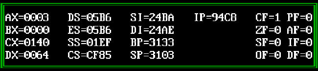
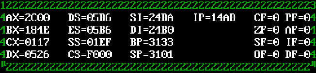
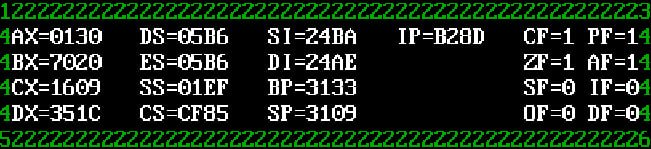
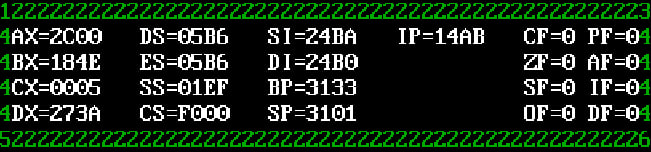
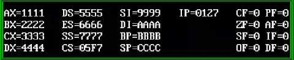

# Frame

## Description
This is a resident program for **DOS**.
It draws frame with current values of registers and flags of the interrupted program at any time.
Pressing the "ё" key ("`" in English layout) displays a green frame on the screen with a table of registers (**AX, BX, CX, DX, ES, SS, CS, SI, DI, BP, SP, IP**) and flags (**CF, ZF, SF, OF, PF, AF, IF, DF**).
Pressing the "=" key turns off the display and clears the frame.

Supposed to be ran on DOSBox.

## Build
For compilation use **Turbo Assembler (TASM)**:
```powershell
tasm regs.asm
tlink /t regs.obj
```

## Run program

### Format
```powershell
regs.com <FrameStyleSymbols (optional)>
```

#### Command line parameters
You can change the characters used to draw the frame using this order:
```
1. Top‑left corner      (default ╔ – 0xC9)
2. Horizontal line      (default ═ – 0xCD)
3. Top‑right corner     (default ╗ – 0xBB)
4. Vertical line        (default ║ – 0xBA)
5. Bottom‑left corner   (default ╚ – 0xC8)
6. Bottom‑right corner  (default ╝ – 0xBC)
```

#### Frame customizing examples

##### Example 1
If you run the program without command line arguments and press "ё", it will draw a frame using standard borders style.
```powershell
regs.com
```



##### Example 2
If you run the program with 1-5 command line arguments and press "ё", it will draw a frame using a mix of user-provided symbols and default ones.
```powershell
regs.com 1234
```


##### Example 3.1
If you run the program with 6 command line arguments and press "ё" it will draw a frame using only user-provided symbols.
```powershell
regs.com 123456
```


##### Example 3.2
This example shows that the program ignores symbols after the sixth.
If you run the program with more than 6 command line arguments and press "ё", it still draws a frame using only user-provided symbols.
```powershell
regs.com 123456789
```



### Using resident program after installation

1. Run any program
2. Press "ё" (or "`" in English layout)
3. A green frame appears on the screen with the current register and flag values of the program that was interrupted by the key press. The data is refreshed at every timer tick (~18.2 times per second).
4. To hide the frame press `=`. The display turns off and the frame is cleared.
5. The program remains in memory until reboot.

#### Example 1
Let's write the simple program with the infinite loop to check, how does the program work.

```assembler
.model tiny
.code
org 100h

Start:

permanent:
			mov bx, 02222h
			mov cx, 03333h
			mov dx, 04444h

			mov ax, 05555h
			push ax
			pop ds

			mov ax, 06666h
			push ax
			pop es

			mov ax, 07777h
			push ax
			pop ss

			mov si, 09999h
			mov di, 0AAAAh
			mov bp, 0BBBBh
			mov sp, 0CCCCh

			mov ax, 01111h
			jmp permanent

end			Start
```

Before starting this test program install the resident program and turn on the frame with registers (press "ё"). Then start the test program.
This example verifies that the resident program reads and displays all registers accurately.



